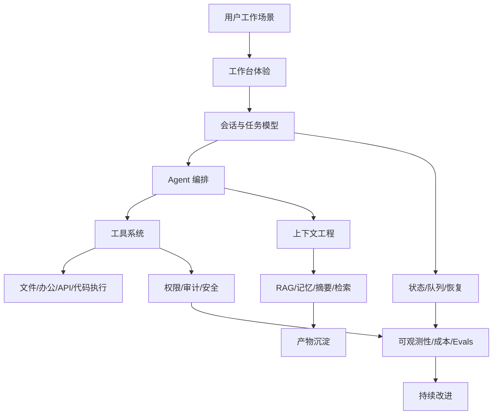

# 20260625-功能完备AI-Agent工作台学习路线

> 本页是对 [[../summaries/20260625-Codex-从0搭建AI-Agent工作台规划]] 的二次整理：先生的目标不是只做一个 MVP AI Agent，而是系统学习如何搭建一个功能完备、真实好用的 AI Agent 工作台。

## 结论先行

学习 AI Agent 工作台，不能按“模型 -> prompt -> demo”来学，而要按“工作系统”来学。

推荐主线：

```text
产品场景 -> 工作台 UX -> 数据模型 -> Agent 编排 -> 工具系统 -> 上下文工程 -> 生产化治理 -> 评测与迭代
```

MVP 的价值是帮你跑通第一个闭环，但真正的学习目标应是理解完整能力图谱。

## 学习总图



## 第一阶段：理解产品，不急着写代码

学习问题：

- 用户为什么要用工作台，而不是直接打开 ChatGPT？
- 哪些任务适合 Agent 自动做，哪些必须人工确认？
- 工作台的第一屏应该让用户看到“聊天框”，还是“正在推进的工作”？

应掌握概念：

- [[AI Agent 工作台]]
- [[Agent 工作台能力分层]]
- [[Agent 工作台产品化]]

产出物：

- 产品场景清单。
- 目标用户画像。
- 3 个核心任务闭环。
- 不做清单。

## 第二阶段：搭建工作台骨架

学习问题：

- 会话、任务、消息、工具调用、文件之间是什么关系？
- 用户刷新页面后，哪些状态必须保留？
- 长任务如何从前台切到后台？

建议数据模型：

- users
- workspaces
- conversations
- messages
- tasks
- task_steps
- files
- artifacts
- tool_calls
- integrations

重点不是字段多，而是建立“任务可追踪”的骨架。

## 第三阶段：学习 Agent 编排

学习问题：

- Agent 什么时候应该规划？
- 什么时候直接回答？
- 工具失败后如何继续？
- 什么任务适合单 Agent，什么任务才需要多 Agent？

核心模块：

- Planner
- Executor
- Tool Router
- Memory Manager
- Guardrails
- Human Approval

与既有知识连接：

- [[Agentic Engineering]]
- [[Goal-Driven Execution]]
- [[Agent工程化兜底]]

## 第四阶段：学习工具系统

学习问题：

- 一个工具如何声明参数？
- 工具结果如何返回给模型？
- 如何限制工具权限？
- 如何记录工具调用？

工具系统最少要有：

- Tool Registry：工具注册表。
- Schema Validation：参数校验。
- Permission Check：权限检查。
- Tool Executor：执行器。
- Tool Call Log：调用日志。
- Error Handling：失败处理。

与既有知识连接：

- [[../entities/MCP|MCP]]
- [[工具调用幻觉]]
- [[字段级权限]]
- [[Agent Gateway协议翻译层]]

## 第五阶段：学习上下文工程与知识库

学习问题：

- 哪些消息应该进入 prompt？
- 文件太大怎么办？
- 历史会话怎么复用？
- RAG 和长期记忆如何分工？

核心能力：

- 文件解析。
- 文档切片。
- Embedding。
- 向量检索。
- 摘要压缩。
- Just-in-Time 检索。
- 项目记忆。

与既有知识连接：

- [[上下文工程]]
- [[RAG]]
- [[Just-in-Time检索]]
- [[上下文膨胀与压缩]]
- [[LLM Wiki]]

## 第六阶段：学习生产化治理

学习问题：

- 如何让用户信任 Agent？
- 如何避免危险动作？
- 如何知道系统哪里失败最多？
- 如何控制成本？

关键系统：

- 权限系统。
- 审批系统。
- 审计日志。
- 成本统计。
- 速率限制。
- 监控告警。
- Evals。
- 用户反馈闭环。

与既有知识连接：

- [[Agent 工作台产品化]]
- [[验证瓶颈]]
- [[规范偏差正常化]]
- [[反馈闭环写入文件]]

## 第七阶段：学习竞品和一手源

本次资料是自产规划，不应替代一手源。下一步应正式 ingest：

- OpenAI Agents SDK 官方文档：Agent definitions、orchestration、guardrails、state、observability、evals。
- LangGraph 官方文档：graph/state/checkpoint/human-in-the-loop/multi-agent。
- Vercel AI SDK 官方文档：streaming UI、tool calling、chat persistence。
- MCP 官方文档：client/server/tools/resources/prompts/security。
- WorkBuddy / CodeBuddy / OpenClaw / OpenClacky 的官方演示或源码资料。

这些资料应各自进入 `raw/` 和 `wiki/summaries/`，不要只在本页概括。

## 推荐学习顺序

1. 先做“会话 + 任务 + 工具调用日志”，因为它决定工作台是不是可追踪。
2. 再做“文件上传 + RAG”，因为这决定能不能处理真实资料。
3. 再做“后台任务 + 失败恢复”，因为这决定复杂任务能不能跑完。
4. 再做“权限 + 审批 + 审计”，因为这决定用户敢不敢接入真实办公系统。
5. 最后做“多 Agent + 插件市场 + 企业化”，因为这些是放大器，不是地基。

## 一个重要判断

功能完备的 AI Agent 工作台不是“更聪明的聊天框”，而是一个新的工作操作系统雏形。

聊天框只是入口；真正的壁垒在：

- 工作流建模。
- 工具连接。
- 上下文组织。
- 可观测和可恢复。
- 权限与信任。
- 持续学习和知识沉淀。

这正好与本知识库的 [[LLM Wiki]] 思想同构：每次工作都不应该问完即忘，而应该沉淀为可复用的知识、任务模板、工具和流程。
